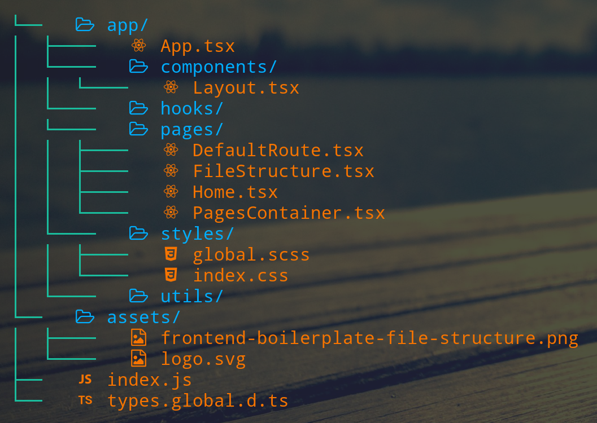

# Front End Boilerplate

- This boilerplate it's your base for your front end projects. The intention it's for it to be a simple, highly readable and modifiable as a strong intial ground for you to start building web applications.

## File Structure

## Features

- React.
- SASS.
- Webpack.
- live loader.

## Why Another Boilerplate

- Basically i was looking for a simple boilerplate to get me started on my projects and even though i was able to find many the complexity of them made it so hard get setup (controversial right?). And even after setting everything up and ended coding i was about to deploy when the code wouldn't build for production, and after (many) hours of debugging some others people code i was not able to get it to work, and so i decided to make this boilerplate.

## TODO

- [ ] Add images to this readme.
- [ ] Clean the log on server update.
- [x] Optimize production.
- [x] Add a map of the file structure. Maybe adapt it for Redux?
- [x] Add react router basic structure.

## Contributors

- @TomiVidal99 [https://tomas-vidal.xyz]
